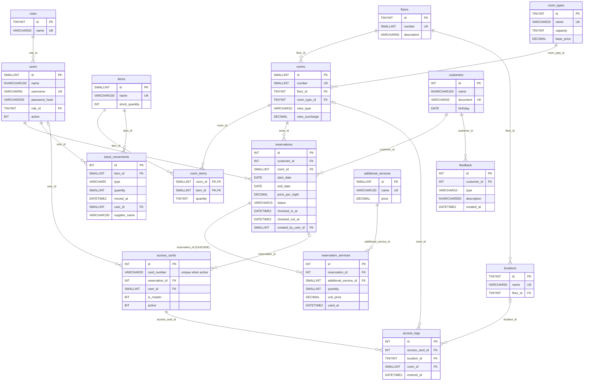

# H4Y-10 - ER Diagram

Diagram of the schema in [schema.md](schema.md). View it on GitHub or at mermaid.live.

```mermaid
erDiagram
    floors ||--o{ rooms : "floor_id"
    floors ||--o{ locations : "floor_id"
    room_types ||--o{ rooms : "room_type_id"
    rooms ||--o{ room_items : "room_id"
    items ||--o{ room_items : "item_id"
    items ||--o{ stock_movements : "item_id"
    roles ||--o{ users : "role_id"
    users ||--o{ reservations : "created_by_user_id"
    users ||--o{ stock_movements : "user_id"
    users |o--o{ access_cards : "user_id"
    customers ||--o{ reservations : "customer_id"
    customers ||--o{ feedback : "customer_id"
    rooms ||--o{ reservations : "room_id"
    reservations ||--o{ reservation_services : "reservation_id (CASCADE)"
    additional_services ||--o{ reservation_services : "additional_service_id"
    reservations |o--o{ access_cards : "reservation_id"
    access_cards ||--o{ access_logs : "access_card_id"
    locations |o--o{ access_logs : "location_id"
    rooms |o--o{ access_logs : "room_id"

    floors {
        TINYINT id PK
        SMALLINT number UK
        VARCHAR50 description
    }
    room_types {
        TINYINT id PK
        VARCHAR20 name UK
        TINYINT capacity
        DECIMAL base_price
    }
    rooms {
        SMALLINT id PK
        SMALLINT number UK
        TINYINT floor_id FK
        TINYINT room_type_id FK
        VARCHAR10 view_type
        DECIMAL view_surcharge
    }
    locations {
        TINYINT id PK
        VARCHAR50 name UK
        TINYINT floor_id FK
    }
    items {
        SMALLINT id PK
        VARCHAR100 name UK
        INT stock_quantity
    }
    room_items {
        SMALLINT room_id PK,FK
        SMALLINT item_id PK,FK
        TINYINT quantity
    }
    stock_movements {
        INT id PK
        SMALLINT item_id FK
        VARCHAR5 type
        SMALLINT quantity
        DATETIME2 moved_at
        SMALLINT user_id FK
        VARCHAR100 supplier_name
    }
    customers {
        INT id PK
        NVARCHAR100 name
        VARCHAR20 document UK
        DATE birthday
    }
    roles {
        TINYINT id PK
        VARCHAR20 name UK
    }
    users {
        SMALLINT id PK
        NVARCHAR100 name
        VARCHAR50 username UK
        VARCHAR255 password_hash
        TINYINT role_id FK
        BIT active
    }
    reservations {
        INT id PK
        INT customer_id FK
        SMALLINT room_id FK
        DATE start_date
        DATE end_date
        DECIMAL price_per_night
        VARCHAR15 status
        DATETIME2 checked_in_at
        DATETIME2 checked_out_at
        SMALLINT created_by_user_id FK
    }
    additional_services {
        SMALLINT id PK
        VARCHAR100 name UK
        DECIMAL price
    }
    reservation_services {
        INT id PK
        INT reservation_id FK
        SMALLINT additional_service_id FK
        SMALLINT quantity
        DECIMAL unit_price
        DATETIME2 used_at
    }
    access_cards {
        INT id PK
        VARCHAR20 card_number "unique when active"
        INT reservation_id FK
        SMALLINT user_id FK
        BIT is_master
        BIT active
    }
    access_logs {
        INT id PK
        INT access_card_id FK
        TINYINT location_id FK
        SMALLINT room_id FK
        DATETIME2 entered_at
    }
    feedback {
        INT id PK
        INT customer_id FK
        VARCHAR10 type
        NVARCHAR500 description
        DATETIME2 created_at
    }
```
