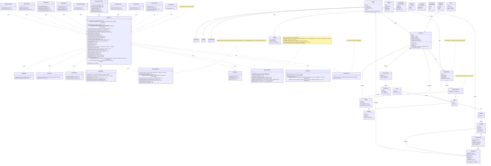

# Hotel4You - Class Diagram (Organized)

```mermaid
classDiagram
    %% ==========================================
    %% LAYER 1: INTERFACE (JavaFX Controllers)
    %% ==========================================
    class LoginController {
        +onLoginClicked() void
    }
    class RoomController {
        +onSearchClicked() void
        +onSaveRoomClicked() void
        +onConfigureRoomItemClicked() void
        +onSavePriceClicked() void
    }
    class ClientController {
        +onRegisterClientClicked() void
        +onSearchClientClicked() void
    }
    class ReservationController {
        +onCreateReservationClicked() void
        +onCancelReservationClicked() void
        +onDeleteReservationClicked() void
        +onAddExtraClicked() void
        +onRemoveExtraClicked() void
        +onAddLocationClicked() void
        +onRemoveLocationClicked() void
    }
    class LocationController {
        +onSaveLocationClicked() void
        +onRemoveLocationClicked() void
    }
    class CheckInOutController {
        +onCheckInClicked() void
        +onCheckOutClicked() void
    }
    class StaffController {
        +onCreateStaffClicked() void
        +onEditStaffClicked() void
        +onRemoveStaffClicked() void
        +onListUsersClicked() void
    }
    class CardController {
        +onIssueCardClicked() void
        +onIssueMasterCardClicked() void
        +onBlockMasterCardClicked() void
        +onShowPlacesByCardClicked() void
        +onShowPassesByRoomClicked() void
    }
    class StockController {
        +onImportXmlClicked() void
        +onSaveItemClicked() void
        +onRegisterMovementClicked() void
    }
    class FeedbackController {
        +onSaveFeedbackClicked() void
        +onListFeedbackClicked() void
    }

    %% ==========================================
    %% LAYER 2: BUSINESS - FACADE
    %% ==========================================
    class HotelFacade {
        +login(username: String, password: String) User
        +createReservation(client: Client, room: Room, start: LocalDate, end: LocalDate) Reservation
        +cancelReservation(reservation: Reservation) void
        +deleteReservation(reservation: Reservation, user: User) void
        +addExtra(reservation: Reservation, service: ExtraService, quantity: int) ReservationExtra
        +removeExtra(reservation: Reservation, extra: ReservationExtra) void
        +addLocation(reservation: Reservation, location: Location) void
        +removeLocation(reservation: Reservation, location: Location) void
        +registerClient(name: String, document: String, birthday: LocalDate) Client
        +findClient(document: String) Client
        +checkIn(reservation: Reservation) void
        +checkOut(reservation: Reservation) void
        +issueCard(reservation: Reservation) MagneticCard
        +issueMasterCard(manager: Manager) MagneticCard
        +blockMasterCard(card: MagneticCard) void
        +getPlacesByCard(card: MagneticCard) List~CardAccessRecord~
        +getPassesByRoom(room: Room) List~CardAccessRecord~
        +createStaff(user: User) void
        +editStaff(user: User) void
        +removeStaff(user: User) void
        +listUsers() List~User~
        +searchRooms(start: LocalDate, end: LocalDate, type: RoomType) List~Room~
        +saveRoom(room: Room) Room
        +configureRoomItem(room: Room, item: StockItem, quantity: int) void
        +setBasePrice(type: RoomType, price: BigDecimal) void
        +setExtraPrice(service: ExtraService, price: BigDecimal) void
        +createLocation(location: Location) void
        +editLocation(location: Location) void
        +removeLocation(location: Location) void
        +importStock(file: String, user: User) StockImport
        +createItem(name: String, unit: String) StockItem
        +editItem(item: StockItem) void
        +registerMovement(item: StockItem, type: MovementType, quantity: int, exitReason: ExitReason, user: User) StockMovement
        +saveFeedback(client: Client, type: FeedbackType, description: String) Feedback
        +listFeedback() List~Feedback~
    }

    %% ==========================================
    %% LAYER 2: BUSINESS - SERVICES
    %% ==========================================
    class AuthService {
        +login(username: String, password: String) User
        +hashPassword(password: String) String
    }
    class ClientService {
        +register(name: String, document: String, birthday: LocalDate) Client
        +find(document: String) Client
    }
    class LocationService {
        +createLocation(location: Location) void
        +editLocation(location: Location) void
        +removeLocation(location: Location) void
    }
    class RoomService {
        +isAvailable(room: Room, start: LocalDate, end: LocalDate) boolean
        +searchRooms(start: LocalDate, end: LocalDate, type: RoomType) List~Room~
        +saveRoom(room: Room) Room
        +configureItem(room: Room, item: StockItem, quantity: int) void
        +setBasePrice(type: RoomType, price: BigDecimal) void
        +setExtraPrice(service: ExtraService, price: BigDecimal) void
    }
    class ReservationService {
        +create(client: Client, room: Room, start: LocalDate, end: LocalDate) Reservation
        +cancel(reservation: Reservation) void
        +delete(reservation: Reservation, user: User) void
        +addExtra(reservation: Reservation, service: ExtraService, quantity: int) ReservationExtra
        +removeExtra(reservation: Reservation, extra: ReservationExtra) void
        +addLocation(reservation: Reservation, location: Location) void
        +removeLocation(reservation: Reservation, location: Location) void
        +checkIn(reservation: Reservation) void
        +checkOut(reservation: Reservation) void
    }
    class StaffService {
        +createStaff(user: User) void
        +editStaff(user: User) void
        +removeStaff(user: User) void
        +listUsers() List~User~
    }
    class CardAccessService {
        +issueCard(reservation: Reservation) MagneticCard
        +issueMasterCard(manager: Manager) MagneticCard
        +blockCard(card: MagneticCard) void
        +canOpen(card: MagneticCard, location: Location) boolean
        +canOpenRoom(card: MagneticCard, room: Room) boolean
        +register(card: MagneticCard, room: Room, location: Location) CardAccessRecord
        +getPlacesByCard(card: MagneticCard) List~CardAccessRecord~
        +getPassesByRoom(room: Room) List~CardAccessRecord~
    }
    class StockService {
        +importStock(file: String, user: User) StockImport
        +createItem(name: String, unit: String) StockItem
        +editItem(item: StockItem) void
        +registerMovement(item: StockItem, type: MovementType, quantity: int, exitReason: ExitReason, user: User) StockMovement
        +applyMovement(item: StockItem, type: MovementType, quantity: int, exitReason: ExitReason, user: User) StockMovement
    }
    class FeedbackService {
        +save(client: Client, type: FeedbackType, description: String) Feedback
        +list() List~Feedback~
    }

    %% ==========================================
    %% LAYER 3: DOMAIN - USERS
    %% ==========================================
    class User {
        <<abstract>>
        -id: Long
        -name: String
        -username: String
        -passwordHash: String
        -role: Role
        +checkPassword(password: String) boolean
    }
    class Receptionist
    class Manager
    class RestaurantStaff
    class Client {
        -id: Long
        -name: String
        -document: String
        -birthday: LocalDate
    }

    %% ==========================================
    %% LAYER 3: DOMAIN - HOTEL
    %% ==========================================
    class Floor {
        -number: int
        -description: String
    }
    class Location {
        -id: Long
        -name: String
        -guestCardAccess: boolean
        -requiresReservation: boolean
    }
    class Room {
        -id: Long
        -number: int
    }
    class RoomType {
        -id: Long
        -name: String
        -capacity: int
        -basePrice: BigDecimal
    }
    class RoomItem {
        -quantity: int
    }
    class Reservation {
        -id: Long
        -startDate: LocalDate
        -endDate: LocalDate
        -status: ReservationStatus
        -checkedInAt: LocalDateTime
        -checkedOutAt: LocalDateTime
        +checkIn() void
        +checkOut() void
        +cancel() void
        +overlaps(start: LocalDate, end: LocalDate) boolean
        +calculateTotal() BigDecimal
    }
    class ReservationExtra {
        -quantity: int
        -unitPrice: BigDecimal
        -usedAt: LocalDateTime
    }
    class MagneticCard {
        -id: Long
        -number: String
        -type: CardType
        -active: boolean
        -blockedAt: LocalDateTime
    }
    class CardAccessRecord {
        -entryDateTime: LocalDateTime
    }

    %% ==========================================
    %% LAYER 3: DOMAIN - EXTRAS
    %% ==========================================
    class ExtraService {
        -id: Long
        -name: String
        -price: BigDecimal
    }

    %% ==========================================
    %% LAYER 3: DOMAIN - STOCK
    %% ==========================================
    class StockItem {
        -id: Long
        -name: String
        -unit: String
        -stockQuantity: int
        -price: BigDecimal
    }
    class StockMovement {
        -type: MovementType
        -quantity: int
        -dateTime: LocalDateTime
        -exitReason: ExitReason
        -unitPrice: BigDecimal
    }
    class StockImport {
        -supplierName: String
        -importedAt: LocalDateTime
        -fileHash: String
        -createdCount: int
        -updatedCount: int
        -invalidCount: int
        -invalidItems: List~String~
        +getInvalidItems() List~String~
    }

    %% ==========================================
    %% LAYER 3: DOMAIN - FEEDBACK
    %% ==========================================
    class Feedback {
        -type: FeedbackType
        -description: String
        -createdAt: LocalDateTime
    }

    %% ==========================================
    %% ENUMS
    %% ==========================================
    class Role {
        <<enumeration>>
        CLIENT
        RECEPTIONIST
        MANAGER
        RESTAURANT
        SUPPLIER
    }
    class ReservationStatus {
        <<enumeration>>
        RESERVED
        CANCELLED
        CHECKED_IN
        CHECKED_OUT
    }
    class CardType {
        <<enumeration>>
        CLIENT
        MASTER
    }
    class FeedbackType {
        <<enumeration>>
        SUGGESTION
        COMPLAINT
    }
    class MovementType {
        <<enumeration>>
        ENTRY
        USE
        EXIT
    }
    class ExitReason {
        <<enumeration>>
        DISCARD
        RETURN
        LOSS
    }

    %% ==========================================
    %% INHERITANCES
    %% ==========================================
    User <|-- Receptionist
    User <|-- Manager
    User <|-- RestaurantStaff

    %% ==========================================
    %% ASSOCIATIONS
    %% ==========================================
    Client "1" --> "*" Reservation : makes
    Room "1" --> "*" Reservation : reserved in
    User "1" --> "*" Reservation : creates
    Reservation "1" *-- "*" ReservationExtra : includes
    ReservationExtra "*" --> "1" ExtraService : refers to
    Reservation "0..1" --> "0..1" MagneticCard : has
    User "0..1" --> "*" MagneticCard : owns
    MagneticCard "1" --> "*" CardAccessRecord : generates
    CardAccessRecord "*" --> "0..1" Room : at
    CardAccessRecord "*" --> "0..1" Location : at
    Floor "1" --> "*" Location : contains
    Floor "1" --> "*" Room : contains
    Room "*" --> "1" RoomType : has
    Room "1" --> "*" RoomItem : has
    RoomItem "*" --> "1" StockItem : refers to
    Reservation "*" --> "*" Location : includes
    Client "0..1" --> "*" Feedback : leaves
    StockItem "1" --> "*" StockMovement : has
    User "1" --> "*" StockMovement : records
    StockMovement "*" --> "0..1" StockImport : from
    StockImport "*" --> "1" User : imported by
    StockItem "*" --> "0..1" StockImport : created by

    %% ==========================================
    %% DEPENDENCIES (Controllers -> Facade)
    %% ==========================================
    LoginController ..> HotelFacade : uses
    RoomController ..> HotelFacade : uses
    ClientController ..> HotelFacade : uses
    LocationController ..> HotelFacade : uses
    ReservationController ..> HotelFacade : uses
    CheckInOutController ..> HotelFacade : uses
    StaffController ..> HotelFacade : uses
    CardController ..> HotelFacade : uses
    StockController ..> HotelFacade : uses
    FeedbackController ..> HotelFacade : uses

    %% ==========================================
    %% DEPENDENCIES (Facade -> Services)
    %% ==========================================
    HotelFacade ..> AuthService : uses
    HotelFacade ..> ClientService : uses
    HotelFacade ..> RoomService : uses
    HotelFacade ..> LocationService : uses
    HotelFacade ..> ReservationService : uses
    HotelFacade ..> StaffService : uses
    HotelFacade ..> CardAccessService : uses
    HotelFacade ..> StockService : uses
    HotelFacade ..> FeedbackService : uses

    %% ==========================================
    %% NOTE
    %% ==========================================
    note for HotelFacade "The business layer does not use JavaFX."
    note for FeedbackService "client may be null (anonymous feedback)"
    note for CardAccessRecord "Each record has a Room OR a Location, never both."
    note for ReservationService "addLocation and removeLocation accept only locations with guestCardAccess = true and requiresReservation = true. Allowed only before check-in."
    note for CardAccessService "Master card opens every room and every zone.<br/>Client card opens only its own room and zones with guestCardAccess = true. If requiresReservation = true, only zones included in its reservation.<br/>A blocked or inactive card opens nothing.<br/>Receptionist card opens only zones on floors 0 and 1 and no guest room.<br/>Restaurant staff card opens only the kitchen and the restaurant and no guest room.<br/>A staff card never opens a guest room. Only the master card does."
    note for MagneticCard "A card belongs to a Reservation OR a staff User, never both."
```

AI use: Claude Code, claude-sonnet-5-5, 2026-10-16. Also edited by doc-updater, Claude Sonnet 5.5, 2026-10-16. Reviewed by: pending.
